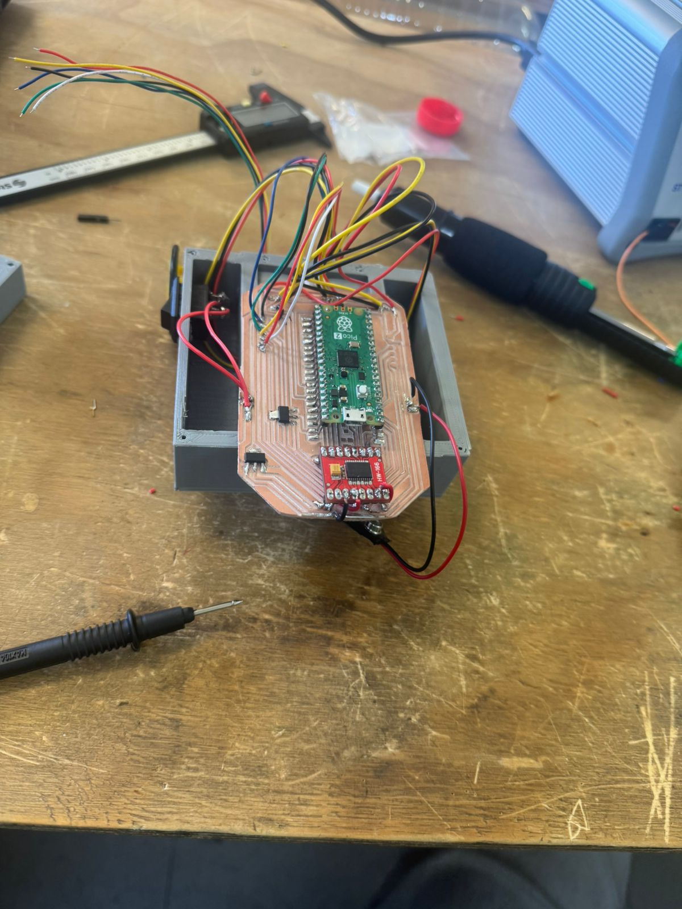

# 🐭 Proyecto — Micromouse (Apstone)

> Robot móvil autónomo que **explora un laberinto**, construye un **mapa** y ejecuta una **fast run** óptima hacia el centro.

---

## 1) Resumen

- **Nombre del proyecto:** Micromouse  
- **Autor(es):** _[Equipo Micromouse]_  
- **Curso / Asignatura:** Apstone / Proyecto de Ingeniería  
- **Modo de operación:** `MODO_ARENA` (binario final para competencia)  
- **Descripción breve:**  
  Desarrollo de un robot autónomo capaz de **explorar un laberinto 16×16**, construir su mapa, encontrar una ruta óptima y ejecutar una **carrera rápida** minimizando el tiempo total.

!!! tip "Idea clave"
    El objetivo no es solo que el robot llegue a la meta, sino que **lo haga rápido, robusto y de forma repetible**, con buena ingeniería detrás.

---

## 2) Alcance y entregables obligatorios

### 2.1 Alcance

El proyecto incluye:

- Diseño **mecánico**, **electrónico** y **de control** del Micromouse.  
- Algoritmos de:
  - **Exploración** del laberinto.
  - **Construcción de mapa** (memoria / estructuras de datos).
  - **Búsqueda de ruta** y **fast run**.
- Implementación de:
  - `MODO_ARENA` para competencia.
  - Mecanismos de **seguridad** (kill switch, batería protegida, etc.).

**No incluye** (opcional / extra):

- Comunicación inalámbrica durante la carrera.  
- Interfaces gráficas avanzadas.  
- Telemetría compleja en tiempo real durante el evento (solo setup).

### 2.2 Entregables obligatorios

- ✅ **Robot funcional** con binario `MODO_ARENA`.  
- ✅ **Bitácora técnica final** (1 página) con:
  - Arquitectura y diagrama (pinout y clocks).  
  - Pruebas clave y resultados.  
  - Métricas y decisiones de diseño.  
  - Lecciones aprendidas.
- ✅ **Código fuente**:
  - Repositorio con rama estable.  
  - **Tag de release** del binario usado en la competencia.  
  - Mapa de pines y configuración de relojes (clocks).
- ✅ **Acta de resultados** del evento firmada por jueces.

---

## 3) Especificaciones del laberinto 🧱

- **Tamaño total:** 16×16 celdas.  
- **Zona objetivo:** área 2×2 en el centro del laberinto.  
- **Celdas:** ≈ 15×15 cm.  
- **Paredes:** ≈ 5 cm de alto (puede variar).  
- **Superficie:** nivelada, con fricción suficiente para tracción.  
- **Condición de meta:**  
  La meta se considera alcanzada cuando el **centro geométrico del robot** entra en la zona objetivo.

!!! info "Implicación de diseño"
    Tus algoritmos de posición/odometría deben ser lo bastante buenos para saber **cuándo el centro del robot está dentro de la celda objetivo**, no solo cuando la punta “parece” llegar.

---

## 4) Reglas del robot 🤖

- **Autonomía total:**  
  No se permite ningún control humano durante el intento.
- **Dimensiones máximas:**  
  ≤ 12×12×12 cm. El peso es libre.
- **Seguridad:**
  - Sin elementos punzantes ni cortantes.
  - Sin líquidos, humo ni materiales inflamables.
  - Sin piezas sueltas.
- **Kill switch:**
  - Obligatorio.  
  - Accesible **sin levantar** el robot.
- **Integridad del hardware:**
  - Cableado firme.  
  - Batería protegida mecánica y eléctricamente.

!!! warning "Seguridad primero"
    Un robot que **no pasa inspección de seguridad** no participa, aunque funcione perfecto a nivel de control.

---

## 5) Formato de competencia 🏁

- Cada equipo dispone de **hasta 3 intentos** cronometrados.  
- Cada intento incluye **dos fases**:
  1. **Exploración** (map building).  
  2. **Fast run** (carrera óptima con el mapa ya construido).
- **Acciones inválidas** (anulan el intento):
  - Asistencia manual al robot.  
  - Levantar el robot del laberinto.  
  - Salida deliberada de pista.  
  - Daño al laberinto o a otros robots.

---

## 6) Cronograma del evento (min) ⏱️

| Tiempo       | Actividad                            |
|--------------|--------------------------------------|
| 00:00–00:10  | Registro e inspección de seguridad   |
| 00:10–00:15  | Briefing (reglas y orden)            |
| 00:15–01:30  | Clasificatorios                      |
| 01:30–01:50  | Final                                |
| 01:50–02:00  | Premiación y firma de actas          |

---

## 7) Inspección técnica (checklist) ✅

Checklist previo a la competencia:

- [ ] Dimensiones ≤ **12×12×12 cm**.  
- [ ] **Kill switch** accesible y probado.  
- [ ] Batería y cableado asegurados; sin bordes peligrosos.  
- [ ] `MODO_ARENA` cargado (sin logs verbosos ni debug excesivo).  
- [ ] CLI / telemetría usados solo en setup (no en carrera).  
- [ ] Sin control remoto durante la carrera.

!!! tip "Buen hábito"
    Haz esta checklist **antes de ir al evento** para evitar sorpresas en la mesa de inspección.

---

## 8) Puntuación, bonos y penalizaciones 🧮

- **Tiempo base (Tc):**  
  Mejor **fast run** del equipo en segundos.

### 8.1 Bonos (restan tiempo)

- Exploración **única** (sin reset entre explorar y fast run): **−5 s**.  
- Cero colisiones (validado por jueces): **−3 s**.

### 8.2 Penalizaciones (suman tiempo)

- Colisión clara: **+2 s** por colisión (máx. +10 s).  
- Reinicio manual durante fast run: **+5 s**.  
- Levantar el robot / salida de pista: intento inválido.

### 8.3 Fórmula final

\[
P = T_c + \text{Bonos} - \text{Penalizaciones}
\]

> Nota: usa signos coherentes (bonos negativos, penalizaciones positivas) al calcular.

---

## 9) Criterios de desempate

1. Menor **fast run** (solo Tc, sin bonos/penalizaciones).  
2. Menor **tiempo de exploración**.  
3. Si persiste el empate: **sorteo supervisado** (coin toss).

---

## 10) Documentación y entregas técnicas 📄

### Bitácora técnica final (1 página)

Debe incluir:

- **Arquitectura y diagrama**  
  - Esquema general del sistema.  
  - **Pinout** y configuración de **clocks**.  
- **Pruebas clave:**
  - PIO  
  - DMA  
  - UART  
  - WDT (watchdog)  
  - Energía (reguladores, batería)  
  - EMC / ruido  
  - Uso multicore (si aplica)
- **Métricas:**
  - Tiempos de ejecución por tareas críticas.  
  - Jitter de tareas/ISRs.  
  - % de uso de CPU.  
  - Pérdidas de FIFO/DMA.  
  - Consumo de corriente (exploración vs fast run).
- **Decisiones de diseño y rationale:**  
  Por qué se eligieron ciertos sensores, motores, topologías de control, etc.
- **Lecciones aprendidas:**  
  Qué salió bien, qué falló, qué se mejoraría en una siguiente versión.
- **Diseño de PCB:**  
  Imagen del layout, capas, consideraciones de ruteo.  
- **Código y binarios:**  
  Referencia clara a repositorio, tag y binario final.

---

## 11) Calificación 🎓

- **Desempeño en competencia (ranking, P) — 40%**
  - 1º — 40%  
  - 2º — 36%  
  - 3º — 32%  
  - 4º — 28%  
  - 5º — 24%  
  - 6º — 20%  
  - 7º — 16%  
  - 8º — 12%

- **Ingeniería y robustez del mouse — 30%**  
  PCB, programación, pruebas y calidad de integración.

- **Requisitos técnicos — 20%**  
  Cumplimiento de especificaciones del proyecto y del laberinto.

- **Bitácora técnica — 10%**  
  Claridad, síntesis, métrica y calidad de la documentación.

---

## 12) Materiales y componentes 🔧

Lista inicial (completar en la bitácora con modelos exactos):

- **Tracción**
  - 2 × Micro motorreductor con encoder (6 V DC, compatibles con RPM/torque requeridos).
- **Sensores**
  - 3 × Sensores de muro / distancia  
    - (ej. Sharp IR / TOF / reflectivos — especificar modelo exacto).  
- **Control**
  - 2 × Raspberry Pi Pico 2 (RP2040).  
- **Potencia**
  - 1 × Puente H (driver de motor, modelo a especificar).  
  - 1 × Regulador 9 V → 5 V.  
  - 1 × Regulador 5 V → 3.3 V.  
  - 1 × Batería (especificar tecnología y capacidad).
- **Mecánica y ensamble**
  - 1 × PCB propia (mouse).  
  - Chasis impreso en 3D.  
  - Conectores, tornillería, cables.  
  - Kill switch.

> Nota: en la bitácora final agrega **marca, modelo, cantidades y hojas de datos** relevantes.

---

## 13) Imágenes / diseños 🖼️

### 13.1 Esquemático en Altium

> Esquemático del sistema: RP2350 / Pico, driver HW-166, reguladores 9V→5V y 5V→3.3V, conectores de sensores, motores, batería y switch.

---

### 13.2 PCB del Micromouse

> Diseño de PCB de una sola cara para el Micromouse, optimizado al contorno del chasis con conectores laterales para motores y sensores.

---

### 13.3 Impresión 3D del chasis

> Impresión de las piezas del chasis en impresoras 3D (Ender y Prusa MK4S), usando PLA, con varias pruebas de ajuste.

> Detalle de la impresión del chasis principal en la Prusa MK4S durante el 88% del trabajo.

---

### 13.4 Ensamble electrónico y mecánico

> PCB ya fresada y soldada, montada sobre el chasis 3D, con cableado hacia el driver de motores y la batería.

> Vista lateral del robot con ruedas, interruptor lateral y distribución interna de cables.

---

### 13.5 Pruebas en el laberinto

> Micromouse realizando pruebas iniciales dentro del laberinto físico, validando locomoción, espacio disponible y detección de paredes.

---

### 13.6 Video de pruebas en el laberinto

<!-- OPCIÓN A: video subido al repo -->
<!-- <video controls width="560">
  <source src="../video/micromouse_laberinto.mp4" type="video/mp4">
  Tu navegador no soporta la reproducción de video.
</video -->

<iframe width="560" height="315"
    src="https://www.youtube.com/embed/9NpO4upP--Y"
    title="Micromouse - Pruebas en laberinto"
    frameborder="0"
    allow="accelerometer; autoplay; clipboard-write; encrypted-media; gyroscope; picture-in-picture"
    allowfullscreen>
</iframe>

> Video de pruebas del Micromouse en el laberinto físico.  
> El robot ya logra moverse y reaccionar a las paredes, aunque aún no es la versión final ni la más estable 😅.

---

## 14) Pruebas recomendadas 🔍

- **Odometría y filtro de pose:**
  - Validación del error de posición por celda.  
- **Sensores:**
  - Latencia de lectura.  
  - Jitter de muestreo (con o sin DMA).  
- **Control de motores:**
  - Respuesta a escalón de PWM.  
  - Overshoot, tiempo de establecimiento, velocidad máxima estable.
- **Gestión energética:**
  - Consumo en exploración vs fast run.  
  - Autonomía esperada por carga de batería.
- **Robustez:**
  - Pruebas con pequeñas colisiones.  
  - Pruebas de caída controlada desde poca altura (si aplica).

---

Made with **Material for MkDocs** 🧩
