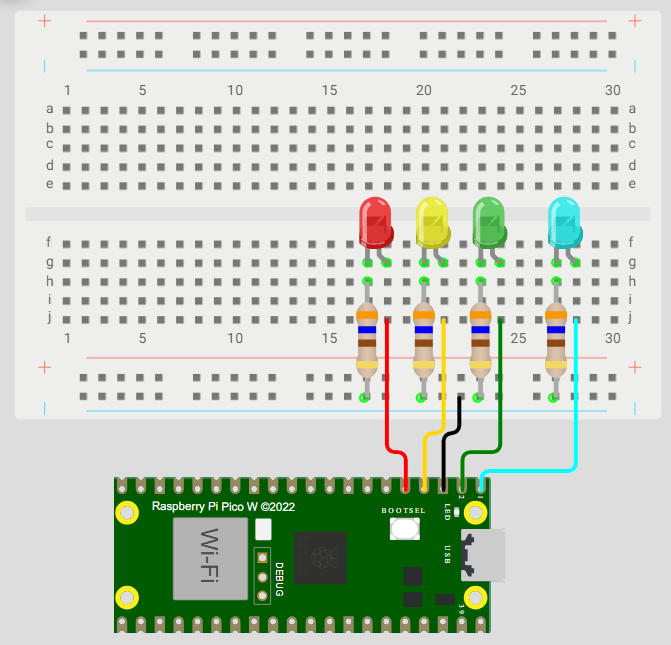

# Tarea 2 – Outputs básicos con lógica y máscaras

## Índice
- [Contador binario de 4 bits](#contador-binario-de-4-bits)  
- [Barrido de LEDs](#barrido-de-leds)  
- [Secuencia en codigo Gray](#secuencia-en-codigo-gray)  

---

## Contador binario de 4 bits {#contador-binario-de-4-bits}

### Nombre del código
Contador binario (4 bits)

### Qué debe hacer
En cuatro LEDs debe mostrarse cada segundo la representación binaria del 0 al 15.

### Código
~~~c
#include "pico/stdlib.h"
#include "hardware/gpio.h"

#define A 0
#define B 1
#define C 2
#define D 3

int main() {
    const uint32_t MASK = (1u<<A) | (1u<<B) | (1u<<C) | (1u<<D);
    gpio_init_mask(MASK);
    gpio_set_dir_masked(MASK, MASK);
    while (true) {
        for (uint8_t i = 0; i < 16; i++) {
            gpio_put_masked(MASK, i << A);
            sleep_ms(500);
        }
    }
}
~~~

### Esquemático de conexión

### Video
_(Aquí irá el enlace al video del funcionamiento)_

---

## Barrido de LEDs {#barrido-de-leds}

### Nombre del código
Barrido de LEDs

### Qué debe hacer
Un “1” corre de LED0 → LED3 y luego regresa (0→1→2→3→2→1…).

### Código
~~~c
// Aquí irá el código del barrido de LEDs
~~~

### Esquemático de conexión

### Video
_(Aquí irá el enlace al video del funcionamiento)_

---

## Secuencia en codigo Gray {#secuencia-en-codigo-gray}

### Nombre del código
Secuencia en codigo Gray

### Qué debe hacer
En los LEDs se debe mostrar la secuencia de Gray, cambiando un bit por vez.

### Código
~~~c
// Aquí irá el código de la secuencia en código Gray
~~~

### Esquemático de conexión

### Video
_(Aquí irá el enlace al video del funcionamiento)_
