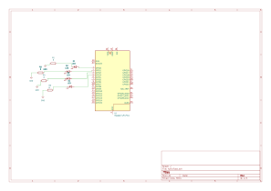
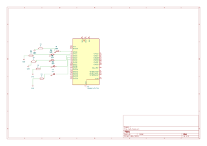
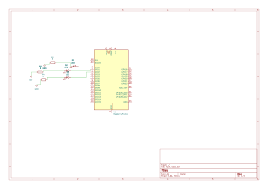

# 📘 Tarea 2 — Outputs básicos con lógica y máscaras

> Tres prácticas con GPIO en Raspberry Pi Pico: **contador binario**, **barrido de LEDs** y **secuencia en código Gray**.

---

## 1) Resumen

- **Nombre del proyecto:** Outputs básicos con lógica y máscaras  
- **Autor:** Carlos Ernesto Camacho González 
- **Curso / Asignatura:** Sistemas Embebidos  
- **Fecha:** 02/09/2025  
- **Descripción breve:** Implementación de patrones de salida con GPIO usando **máscaras**: contador de 4 bits, barrido tipo “ping-pong” y generación de **código Gray**.

!!! tip "Consejo"
    Usa **máscaras** (`MASK`) para configurar y escribir varios pines a la vez: el código queda más corto y rápido.

---

## 2) Objetivos

- **General:** Practicar el uso de **máscaras** de bits para controlar múltiples GPIO y consolidar patrones de salida.
- **Específicos:**
  - Generar un **contador binario** de 4 bits.
  - Implementar un **barrido** asc/desc de LEDs.
  - Producir una **secuencia Gray** de 3 bits usando operaciones a nivel bit.

---

## 3) Alcance y Exclusiones

- **Incluye:** Configuración de GPIO como salida, escritura en paralelo con `gpio_put_masked` / `gpio_set_mask` / `gpio_clr_mask`, y temporización con `sleep_ms`.
- **No incluye:** Interrupciones.

---

## 4) Requisitos

**Hardware**
- Raspberry Pi Pico / Pico 2.
- 3–5 LEDs con resistencias (220–330 Ω) y cableado a los GPIO indicados.

**Conocimientos previos**
- Máscaras de bits, operaciones lógicos.

---

## Contador binario de 4 bits 

### Nombre del código
Contador binario (4 bits)

### Qué debe hacer
Genera un **contador binario ascendente** de 4 bits.  
Los LEDs muestran los valores de **0 a 15**, actualizando cada **500 ms**.

### Código
~~~c
#include "pico/stdlib.h"
#include "hardware/gpio.h"

#define A 0
#define B 1
#define C 2
#define D 3

int main() {
    const uint32_t MASK = (1u<<A) | (1u<<B) | (1u<<C) | (1u<<D);

    gpio_init_mask(MASK);
    gpio_set_dir_masked(MASK, MASK);

    while (true) {
        for (uint8_t i = 0; i < 16; i++) {
            // Escribe i en los pines A..D
            gpio_put_masked(MASK, (uint32_t)i << A);
            sleep_ms(500);
        }
    }
}
~~~

### Esquemático de conexión

### Video
<iframe width="560" height="315"
src="https://www.youtube.com/embed/aDn2G8YxF9o"
frameborder="0" allowfullscreen></iframe>

---

## Barrido de LEDs 

### Nombre del código
Barrido de LEDs (“ping-pong”)

### Qué debe hacer
Enciende **un LED a la vez** en orden ascendente (0→1→2→3→4) y luego descendente (4→3→2→1), repitiendo la secuencia.

### Código
~~~c
#include "pico/stdlib.h"
#include "hardware/gpio.h"

#define A 0   
#define B 1   
#define C 2   
#define D 3 
#define E 4  

int main() {
    const uint32_t MASK = (1u<<A) | (1u<<B) | (1u<<C) | (1u<<D) | (1u<<E);

    gpio_init_mask(MASK);
    gpio_set_dir_out_masked(MASK);
    gpio_clr_mask(MASK);

    while (true) {
        // Subida: 0..4
        for (int i = 0; i < 5; ++i) {
            gpio_clr_mask(MASK);
            gpio_set_mask(1u << i);
            sleep_ms(300);
        }
        // Bajada: 3..1 (evita repetir extremos 4 y 0)
        for (int i = 3; i > 0; --i) {
            gpio_clr_mask(MASK);
            gpio_set_mask(1u << i);
            sleep_ms(300);
        }
    }
}
~~~

### Esquemático de conexión

### Video
<iframe width="560" height="315"
src="https://www.youtube.com/embed/biWVJNRUWUI"
frameborder="0" allowfullscreen></iframe>

---

## Secuencia en código Gray 

### Nombre del código
Secuencia en código Gray (3 bits)

### Qué debe hacer
Muestra la secuencia Gray de **3 bits**: en cada transición **solo cambia 1 bit**.  
Se usa la fórmula `gray = n ^ (n >> 1)`.

### Código
~~~c
#include "pico/stdlib.h"
#include "hardware/gpio.h"

#define A 0
#define B 1
#define C 2

static inline uint8_t bin_to_gray(uint8_t n) {
    return (uint8_t)(n ^ (n >> 1));
}

int main() {
    const uint32_t MASK = (1u<<A) | (1u<<B) | (1u<<C);

    gpio_init_mask(MASK);
    gpio_set_dir_masked(MASK, MASK);

    while (true) {
        for (uint8_t i = 0; i < 8; i++) {
            uint8_t gray = bin_to_gray(i);
            // Escribe gray en pines A..C
            gpio_put_masked(MASK, (uint32_t)gray << A);
            sleep_ms(500);
        }
    }
}
~~~

### Esquemático de conexión

### Video
<iframe width="560" height="315"
src="https://www.youtube.com/embed/Q9hNYVJSGg4"
frameborder="0" allowfullscreen></iframe>

---

## 6) Resultados y conclusiones

- Las **máscaras** simplifican la configuración y escritura simultánea de varios GPIO.  
- El **barrido** demuestra control individual y temporización consistente.  
- La **secuencia Gray** valida operaciones bit a bit (`^`, `>>`) y su aplicación práctica en minimizar cambios simultáneos.

> Próximos pasos: portar a interrupciones/PIO
