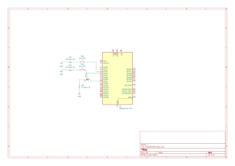

# 📘 Tarea 3 — Inputs con lógica y máscaras

> Dos prácticas con botones y LEDs en Raspberry Pi Pico:  
> **compuertas lógicas AND/OR/XOR** y **selector cíclico** con avance/retroceso.

---

## 1) Resumen

- **Nombre del proyecto:** Inputs con lógica y máscaras  
- **Autor:** Carlos Ernesto Camacho González 
- **Curso / Asignatura:** Sistemas Embebidos  
- **Fecha:** 01/09/2025  
- **Descripción breve:** Se leen botones **pull-up** (presionado=0) para generar salidas en LEDs usando **operadores lógicos** y **máscaras**. Se implementa antirrebote por **detección de flanco**.

!!! tip "Consejo"
    Con pull-up, el botón **presionado** lee `0`. Invierte con `!gpio_get(pin)` para tratar “presionado = 1”.

---

## 2) Objetivos

- **General:** Practicar lectura de entradas digitales y generación de salidas usando operadores lógicos y máscaras.
- **Específicos:**
  - Implementar **AND/OR/XOR** en hardware con botones y LEDs.
  - Diseñar un **selector cíclico** con **avance** y **retroceso** sin repetición mientras se mantiene presionado.
  - Aplicar **antirrebote por flanco** con variables de estado previo.

---

## 3) Alcance y Exclusiones

- **Incluye:** Lectura de GPIO, pull-ups internos, escritura en GPIO, máscaras y detección por flanco.  
- **No incluye:** interrupciones.

---

## 4) Requisitos

**Hardware**
- Raspberry Pi Pico / Pico 2.
- 6 botones (pull-up) y 7–8 LEDs con resistencias.

**Conocimientos previos**
- Operadores lógicos y operaciones de bits.
- Pull-up/pull-down y lógica activa-baja.

---

## Compuertas básicas AND / OR / XOR con 2 botones por puerta

### Qué debe hacer
Con botones **pull-up** (presionado=0) se encienden tres LEDs que muestran el resultado de **AND**, **OR** y **XOR**.  
En los videos se ejemplifican las combinaciones.

### Código
~~~c
#include "pico/stdlib.h"

// Pines AND
#define BTN_A 0      
#define BTN_B 1    
#define LED0  6
// Pines OR
#define BTN_C 2     
#define BTN_D 3    
#define LED1  7
// Pines XOR
#define BTN_E 4      
#define BTN_F 5    
#define LED2  8

static inline bool ANDf(void) {
    bool A_PRESS = !gpio_get(BTN_A);
    bool B_PRESS = !gpio_get(BTN_B);
    return (A_PRESS && B_PRESS);
}

static inline bool ORf(void) {
    bool C_PRESS = !gpio_get(BTN_C);
    bool D_PRESS = !gpio_get(BTN_D);
    return (C_PRESS || D_PRESS);
}

static inline bool XORf(void) {
    bool E_PRESS = !gpio_get(BTN_E);
    bool F_PRESS = !gpio_get(BTN_F);
    return (E_PRESS ^ F_PRESS);
}

int main(void) {
    // LEDs salida
    gpio_init(LED0); gpio_set_dir(LED0, GPIO_OUT);
    gpio_init(LED1); gpio_set_dir(LED1, GPIO_OUT);
    gpio_init(LED2); gpio_set_dir(LED2, GPIO_OUT);

    // Botones con pull-up
    gpio_init(BTN_A); gpio_set_dir(BTN_A, GPIO_IN); gpio_pull_up(BTN_A);
    gpio_init(BTN_B); gpio_set_dir(BTN_B, GPIO_IN); gpio_pull_up(BTN_B);

    gpio_init(BTN_C); gpio_set_dir(BTN_C, GPIO_IN); gpio_pull_up(BTN_C);
    gpio_init(BTN_D); gpio_set_dir(BTN_D, GPIO_IN); gpio_pull_up(BTN_D);

    gpio_init(BTN_E); gpio_set_dir(BTN_E, GPIO_IN); gpio_pull_up(BTN_E);
    gpio_init(BTN_F); gpio_set_dir(BTN_F, GPIO_IN); gpio_pull_up(BTN_F);

    while (true) {
        gpio_put(LED0, ANDf());
        gpio_put(LED1, ORf());
        gpio_put(LED2, XORf());
        sleep_ms(10);
    }
}

~~~

### Esquemático de conexión AND

### Compuerta AND
<iframe width="560" height="315"
src="https://www.youtube.com/embed/YPkeRtyKr-c"
title="Compuerta AND - demostración"
frameborder="0" allowfullscreen></iframe>

### Esquemático de conexión OR

### Compuerta OR
<iframe width="560" height="315"
src="https://www.youtube.com/embed/lDJKUnqY8gc"
title="Compuerta OR - demostración"
frameborder="0" allowfullscreen></iframe>

### Esquemático de conexión XOR

### Compuerta XOR
<iframe width="560" height="315"
src="https://www.youtube.com/embed/QQlD3z9-9Ag"
title="Compuerta XOR - demostración"
frameborder="0" allowfullscreen></iframe>

## Selector cíclico de 4 LEDs con avance/retroceso (antirrebote por flanco)

### Qué debe hacer

Se mantiene un solo LED encendido entre LED0..LED3.
Un botón **AVANZA** (0→1→2→3→0) y otro **RETROCEDE** (0→3→2→1→0).
Un **push** = **un paso** (si se deja presionado no repite gracias a la detección de flanco).

### Código
~~~c
#include "pico/stdlib.h"

#define BTN_PREV 0      
#define BTN_NEXT 1    
#define LED0   2
#define LED1   3
#define LED2   4
#define LED3   5

uint8_t STATE = LED0 - 1;

int main(void) {
    const uint8_t LEDs_M = (1u << LED0 | 1u << LED1 | 1u << LED2 | 1u << LED3);

    gpio_init_mask(LEDs_M);
    gpio_set_dir_out_masked(LEDs_M);
    gpio_set_mask(LEDs_M);   
    gpio_clr_mask(LEDs_M);

    gpio_init(BTN_PREV);
    gpio_set_dir(BTN_PREV, GPIO_IN);
    gpio_pull_up(BTN_PREV);

    gpio_init(BTN_NEXT);
    gpio_set_dir(BTN_NEXT, GPIO_IN);
    gpio_pull_up(BTN_NEXT);

    bool NEXT_PREVSTATE = 1;
    bool PREV_PREVSTATE = 1;

    while (true) {
        bool NEXT_STATE = !gpio_get(BTN_NEXT);
        bool PREV_STATE = !gpio_get(BTN_PREV);

        // Siguiente LED
        if (NEXT_STATE && !NEXT_PREVSTATE) {
            if (STATE == LED3) {
                STATE = LED0;
            } else {
                STATE ++;
            }
            gpio_clr_mask(LEDs_M);                
            gpio_set_mask(1 << STATE);              
        }

        // Anterior LED
        if (PREV_STATE && !PREV_PREVSTATE) {
            if (STATE == LED0) {
                STATE = LED3;
            } else {
                STATE --;
            }
            gpio_clr_mask(LEDs_M);                
            gpio_set_mask(1 << STATE);              
        }

        NEXT_PREVSTATE = NEXT_STATE;
        PREV_PREVSTATE = PREV_STATE;

        sleep_ms(10);
    }
}
~~~

### Demostración
<!-- Video: Selector cíclico -->

  <iframe
    src="https://www.youtube.com/embed/CvLY-u6OfzA"
    title="Selector cíclico - demostración"
    loading="lazy"
    allowfullscreen
    style="position:absolute;top:0;left:0;width:100%;height:100%;border:0;">
  </iframe>

## 5) Resultados y conclusiones

- Las compuertas AND/OR/XOR se implementan directamente con operadores lógicos, cumpliendo “sin enumerar combinaciones”.

- El selector cíclico usa máscaras para encender exactamente un LED.
