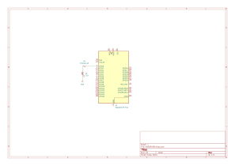
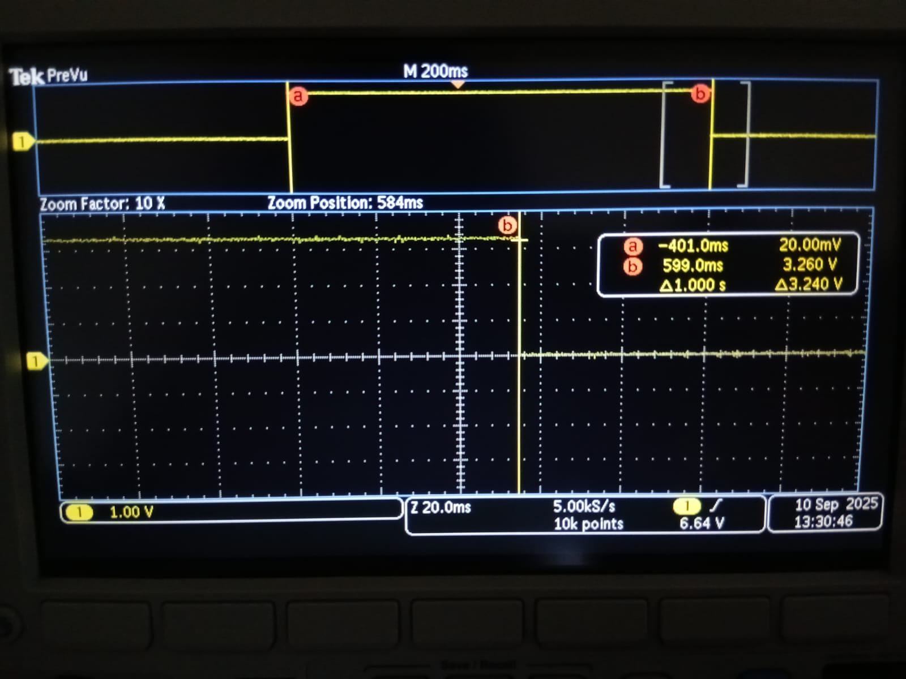
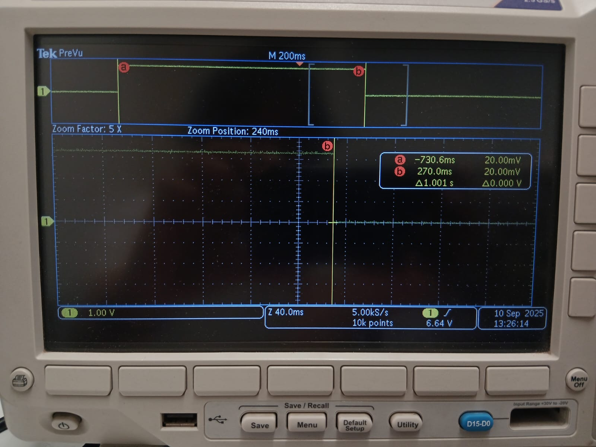

# 📘 Tarea 5 — Ejercicios de medicion 

Genera una onda cuadrada con ALARM0 en interrupción (ISR), con rearme acumulativo y periodo nominal definido. Luego compara modo µs vs modo ciclos (clk_sys) en el RP2350 (Pico 2).

---

## 1) Resumen

- **Nombre del proyecto:** Temporizador de sistema — ALARM0 y medición de jitter  
- **Autor:** Carlos Ernesto Camacho González 
- **Curso / Asignatura:** Sistemas Embebidos  
- **Fecha:** 15/09/2025  
- **Descripción breve:** Se usa el timer del sistema para alternar (toggle) un GPIO desde la ISR de ALARM0.

!!! tip "Consejo"
    

---

## 2) Objetivos

- **General:** Generar una onda cuadrada estable con ALARM0 y caracterizar su jitter.
- **Específicos:**
  - Implementar ISR de ALARM0 con rearme acumulativo.
  - Medir periodo, jitter p-p y RMS con osciloscopio.
  - Comparar precisión entre modo µs y modo ciclos (clk_sys).

---

## 3) Alcance y Exclusiones

- **Incluye:** GPIO, IRQ, system timer ALARM0, medición con osciloscopio.
- **No incluye:** PIO/PWM/DMA.

---

## 4) Requisitos

**Hardware**
- Raspberry Pi Pico 2 (RP2350).
- 1 LED + resistencia (o sólo el GPIO medido con sonda).

**Conocimientos previos**
- Interrupciones, GPIO, y conceptos de jitter/RMS.

---

## 6) Código 1

~~~c
// Blink con timer (SDK alto nivel): cambia BLINK_MS para ajustar
#include "pico/stdlib.h"
#include "pico/time.h"

#define LED_PIN 0                      // <-- LED externo en GP0
static const int BLINK_MS = 500;       // "toggle" cada 500 ms (periodo completo ~1 s)

bool blink_cb(repeating_timer_t *t) {
    static bool on = false;
    gpio_put(LED_PIN, on = !on);   // toggle
    return true;                   // seguir repitiendo
}

int main() {
    stdio_init_all();

    gpio_init(LED_PIN);
    gpio_set_dir(LED_PIN, GPIO_OUT);

    repeating_timer_t timer;
    add_repeating_timer_ms(BLINK_MS, blink_cb, NULL, &timer);

    while (true) {
        tight_loop_contents();     // trabajo pesado va aquí, no en la ISR
    }
}

~~~

##  7) Código 2
~~~c
// Blink con timer de sistema (bajo nivel): ALARM0 + IRQ con rearme acumulativo
#include "pico/stdlib.h"
#include "hardware/irq.h"
#include "hardware/structs/timer.h"
#include "hardware/structs/sio.h"

#define LED_PIN    0                    // <-- LED externo en GP0
#define ALARM_NUM  0                    // usaremos ALARM0

// Número de IRQ asociado a ALARM0
#define ALARM_IRQ  timer_hardware_alarm_get_irq_num(timer_hw, ALARM_NUM)

// próximo instante (en µs) en los 32 bits bajos del contador
static volatile uint32_t next_deadline;
// por defecto el timer cuenta en µs
static volatile uint32_t intervalo_us = 500000u; // <-- "toggle" cada 500 ms (periodo completo ~1 s)

void on_alarm_irq(void) {
    // Limpia la IRQ de ALARM0 (write-1-to-clear)
    hw_set_bits(&timer_hw->intr, 1u << ALARM_NUM);

    // Toggle del LED
    sio_hw->gpio_togl = 1u << LED_PIN;

    // Rearme ACUMULATIVO (evita deriva si la ISR se retrasa)
    next_deadline += intervalo_us;
    timer_hw->alarm[ALARM_NUM] = next_deadline;
}

int main() {
    stdio_init_all();

    // LED de salida
    gpio_init(LED_PIN);
    gpio_set_dir(LED_PIN, GPIO_OUT);
    gpio_put(LED_PIN, 0);

    // Primer deadline
    uint32_t now_us = timer_hw->timerawl;     // 32 bits bajos (µs)
    next_deadline = now_us + intervalo_us;
    timer_hw->alarm[ALARM_NUM] = next_deadline;

    // Enlaza e inicia IRQ
    irq_set_exclusive_handler(ALARM_IRQ, on_alarm_irq);
    hw_set_bits(&timer_hw->inte, 1u << ALARM_NUM);
    irq_set_enabled(ALARM_IRQ, true);

    while (true) {
        tight_loop_contents();
    }
}

~~~

## 7) Esquematico - Raspberry Pi Pico 2 (LED en GP1)

*Figura 1.*

## 8) Resultados 

 **Programa 1**

  - Parámetro del timer: **1.000 s**

  - Medición con cursores: **Δt ≈ 1.001 s** 

  - **Periodo completo** de la onda: **≈ 2.002 s**

  
*Figura 2.* Medición con SDK alto nivel.

 **Programa 2**

  - Parámetro del timer: **1.000 s**

  - Medición con cursores: **Δt ≈ 1.000–1.001 s**

  - **Periodo completo** de la onda: **≈ 2.000–2.002 s**
  

  
*Figura 3.* Medición con ALARM0 + ISR.

## 9) Conclusiones rápidas

- Ambos métodos cumplen el periodo esperado; el desvío de **~+1 ms (~0.1%)** está **dentro del límite de medición** de esa configuración.

