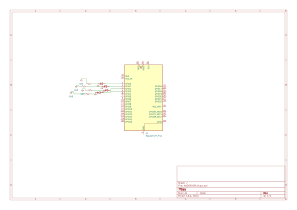
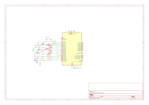

# 📘 Tarea 6 — Ejercicios de Programación
---

## 1) Resumen
- **Nombre del proyecto:** Multialarmas / Control de velocidad en Pong  
- **Autor:** Carlos Ernesto Camacho González  
- **Curso / Asignatura:** Sistemas Embebidos  
- **Fecha:** 16/09/2025  
- **Descripción breve:**  
  - **Ejercicio 1:** Cuatro LEDs a distintas frecuencias con temporizador de **software** (sin interrupciones).  
  - **Ejercicio 2:** **Pong** con dos botones para **subir/bajar** la velocidad **sin `delay`** usando **ALARM0/1** y rearme acumulativo.

---

## 2) Objetivos
- Generar y controlar temporizaciones independientes para múltiples salidas.  
- Ajustar la **velocidad** de un juego sin bloquear el bucle principal.  
- Usar **rearme acumulativo** y antirrebote por **flanco**.

---

## 3) Ejercicio 1 — Cuatro alarmas / cuatro LEDs a distintas frecuencias (sin interrupciones)

### Qué debe hacer
Configurar cuatro LEDs en pines distintos. Cada LED alterna (toggle) con su **intervalo** propio usando un **temporizador de software** basado en `time_us_32()` (sin IRQ).

### Código
~~~c
// Cuatro LEDs a distintas frecuencias (RP2350 / Pico 2) SIN interrupciones.
// LED0=GPIO 1, LED1=GPIO 0, LED2=GPIO 2, LED3=GPIO 3.

#include "pico/stdlib.h"
#include "pico/time.h"
#include "hardware/gpio.h"

#define LED0_PIN 1   // antes: PICO_DEFAULT_LED_PIN
#define LED1_PIN 0
#define LED2_PIN 2
#define LED3_PIN 3

static const uint8_t PINES[4] = { LED0_PIN, LED1_PIN, LED2_PIN, LED3_PIN };

// Intervalo ENTRE toggles (el período visible ON+OFF es el doble)
static const uint32_t INTERVALO_US[4] = {
    300000u, // GPIO 1: 300 ms
    200000u, // GPIO 0: 200 ms
    120000u, // GPIO 2: 120 ms
     80000u  // GPIO 3: 80 ms
};

static uint32_t next_us[4];

int main(void) {
    for (int i = 0; i < 4; ++i) {
        gpio_init(PINES[i]);
        gpio_set_dir(PINES[i], GPIO_OUT);
        gpio_put(PINES[i], 0);
    }

    uint32_t now = time_us_32();
    for (int i = 0; i < 4; ++i) next_us[i] = now + INTERVALO_US[i];

    while (true) {
        now = time_us_32();
        for (int i = 0; i < 4; ++i) {
            if ((int32_t)(now - next_us[i]) >= 0) {
                gpio_xor_mask(1u << PINES[i]);
                next_us[i] += INTERVALO_US[i];   // rearme acumulativo
            }
        }
        tight_loop_contents();
    }
}
~~~
## Esquematico de conexión

*Figura 1.*

## video
<iframe
  width="560"
  height="315"
  src="https://www.youtube.com/embed/FUOUAQumRXs"
  title="Pong - demostración"
  frameborder="0"
  allow="accelerometer; autoplay; clipboard-write; encrypted-media; gyroscope; picture-in-picture; web-share"
  allowfullscreen
  style="border:0;">
</iframe>

## 4) Ejercicio 2 — Pong: dos botones para subir/bajar velocidad (sin delay)

### Qué debe hacer
Añadir BTN_MAS (↑ velocidad) y BTN_MENOS (↓ velocidad). El tempo del juego se controla con ALARMA_JUEGO (modo µs), rearme acumulativo y antirrebote. El parpadeo de punto va con ALARMA_PUNTO (no bloqueante).

### Código
~~~c
#include "pico/stdlib.h"
#include "hardware/irq.h"
#include "hardware/structs/timer.h"
#include "hardware/gpio.h"

#define BTN_J1 0   // Botón jugador izquierda
#define BTN_J2 1   // Botón jugador derecha
#define LED_J1 2   // LED indicador puntos J1
#define LED_J2 3   // LED indicador puntos J2
#define LED0 4     // Posición 0 de LED
#define LED1 5
#define LED2 6     // Centro de LEDs
#define LED3 7
#define LED4 8     // Posición 4 de LED
#define RESET 9    // Botón de reinicio

// Botones NUEVOS
#define BTN_MAS   10  // Subir velocidad
#define BTN_MENOS 11  // Bajar velocidad

// Alarmas del timer
#define ALARMA_JUEGO_NUM  0  // tick de juego
#define ALARMA_PUNTO_NUM  1  // parpadeo de punto
#define IRQ_ALARMA_JUEGO  timer_hardware_alarm_get_irq_num(timer_hw, ALARMA_JUEGO_NUM)
#define IRQ_ALARMA_PUNTO  timer_hardware_alarm_get_irq_num(timer_hw, ALARMA_PUNTO_NUM)

// Velocidades (ms)
#define VEL_PELOTA 100
#define VEL_REBOTE 300

// Rango y paso de velocidad (us)
#define VEL_MIN_US         40000u
#define VEL_MAX_US        400000u
#define VEL_PASO_US        20000u    // salto entre us
#define ANTIRREBOTE_VEL_US 120000u   // antirrebote para botones de velocidad

uint8_t POS = LED2;     // Pelota arranca en el centro
bool DIR = 1;           // 1 = derecha, 0 = izquierda
bool START = false;     // Juego detenido al inicio

volatile bool GOLPE_J1 = false;
volatile bool GOLPE_J2 = false;
volatile bool START_J1 = false;
volatile bool START_J2 = false;
volatile bool RESET_STATE = false;

// Máscaras
uint32_t LEDS_MASK;
static uint32_t MASCARA_LEDS_POS;     // solo LEDs de posición, no marca

// Tiempo y tick
static inline uint32_t microsegundos(void){ return timer_hw->timerawl; }
static volatile uint32_t VEL_PELOTA_US = (uint32_t)VEL_PELOTA * 1000u; // periodo del tick en µs
static volatile uint32_t PROXIMO_TICK_US = 0;
static volatile uint32_t ULTIMO_CAMBIO_VEL_US = 0; // antirrebote de BTN_MAS/BTN_MENOS

// Ventana de rebote fija en tiempo
#define REBOTE_US ((uint32_t)VEL_REBOTE * 1000u)
static volatile bool EN_PARED = false;
static volatile uint32_t VENTANA_HASTA_US = 0;

// Parpadeo no bloqueante (ALARMA_PUNTO)
static volatile bool PARPADEO_ACTIVO = false;
static volatile uint8_t  PIN_LED_PARPADEO = 0;
static volatile uint8_t  PARPADEOS_RESTANTES = 0;
static volatile uint32_t PROXIMO_PARPADEO_US = 0;
#define PARPADEO_MEDIO_US 200000u // 200 ms ON/OFF

// Prototipos requeridos
static void PONG(uint PIN, uint32_t EVENT_MASK);
void BLINK(uint8_t LED);
void REINICIAR();
void MOVER_PELOTA(void);

// ---- ISRs de alarmas
static void irq_alarma_juego(void){
    hw_clear_bits(&timer_hw->intr, 1u << ALARMA_JUEGO_NUM);
    MOVER_PELOTA();
    PROXIMO_TICK_US += VEL_PELOTA_US;                 // rearme acumulativo
    timer_hw->alarm[ALARMA_JUEGO_NUM] = PROXIMO_TICK_US;
}

static void irq_alarma_punto(void){
    hw_clear_bits(&timer_hw->intr, 1u << ALARMA_PUNTO_NUM);

    if (!PARPADEO_ACTIVO || PARPADEOS_RESTANTES == 0){
        gpio_put(PIN_LED_PARPADEO, 0);
        PARPADEO_ACTIVO = false;
        return;
    }
    sio_hw->gpio_togl = (1u << PIN_LED_PARPADEO);
    PARPADEOS_RESTANTES--;
    PROXIMO_PARPADEO_US += PARPADEO_MEDIO_US;         // rearme acumulativo
    timer_hw->alarm[ALARMA_PUNTO_NUM] = PROXIMO_PARPADEO_US;
}

int main() {
    // LEDs
    LEDS_MASK = (1u << LED_J1) | (1u << LED_J2) | (1u << LED0) | (1u << LED1) |
                (1u << LED2) | (1u << LED3) | (1u << LED4);
    MASCARA_LEDS_POS = (1u << LED0) | (1u << LED1) | (1u << LED2) | (1u << LED3) | (1u << LED4);

    gpio_init_mask(LEDS_MASK);
    gpio_set_dir_masked(LEDS_MASK, LEDS_MASK);
    gpio_clr_mask(LEDS_MASK);

    // Botones
    gpio_init(BTN_J1);   gpio_set_dir(BTN_J1, GPIO_IN);   gpio_pull_up(BTN_J1);
    gpio_init(BTN_J2);   gpio_set_dir(BTN_J2, GPIO_IN);   gpio_pull_up(BTN_J2);
    gpio_init(RESET);    gpio_set_dir(RESET,  GPIO_IN);   gpio_pull_up(RESET);
    gpio_init(BTN_MAS);  gpio_set_dir(BTN_MAS, GPIO_IN);  gpio_pull_up(BTN_MAS);
    gpio_init(BTN_MENOS);gpio_set_dir(BTN_MENOS, GPIO_IN);gpio_pull_up(BTN_MENOS);

    gpio_set_mask(1u << POS); // LED inicial en centro

    // IRQ GPIO por flanco de bajada
    gpio_set_irq_enabled_with_callback(BTN_J1, GPIO_IRQ_EDGE_FALL, true, &PONG);
    gpio_set_irq_enabled(BTN_J2,   GPIO_IRQ_EDGE_FALL, true);
    gpio_set_irq_enabled(RESET,    GPIO_IRQ_EDGE_FALL, true);
    gpio_set_irq_enabled(BTN_MAS,  GPIO_IRQ_EDGE_FALL, true);
    gpio_set_irq_enabled(BTN_MENOS,GPIO_IRQ_EDGE_FALL, true);

    // Timer de sistema en µs
    timer_hw->source = 0u;                         // base de tiempo en µs (RP2350)
    uint32_t ahora = microsegundos();

    // Programa ALARMA_JUEGO (primer tick)
    PROXIMO_TICK_US = ahora + VEL_PELOTA_US;
    timer_hw->alarm[ALARMA_JUEGO_NUM] = PROXIMO_TICK_US;

    // Limpia flags, registra handlers y habilita
    hw_clear_bits(&timer_hw->intr, (1u << ALARMA_JUEGO_NUM) | (1u << ALARMA_PUNTO_NUM));
    irq_set_exclusive_handler(IRQ_ALARMA_JUEGO,  irq_alarma_juego);
    irq_set_exclusive_handler(IRQ_ALARMA_PUNTO,  irq_alarma_punto);
    hw_set_bits(&timer_hw->inte, (1u << ALARMA_JUEGO_NUM) | (1u << ALARMA_PUNTO_NUM));
    irq_set_enabled(IRQ_ALARMA_JUEGO,  true);
    irq_set_enabled(IRQ_ALARMA_PUNTO,  true);

    while (true) { tight_loop_contents(); }
}

// ---- ISR GPIO
static void PONG(uint PIN, uint32_t EVENT_MASK) {
    if (EVENT_MASK & GPIO_IRQ_EDGE_FALL) {
        if (PIN == BTN_J1) {
            if (!START) START_J1 = true;
            else if (POS == LED0) GOLPE_J1 = true;
        } else if (PIN == BTN_J2) {
            if (!START) START_J2 = true;
            else if (POS == LED4) GOLPE_J2 = true;
        } else if (PIN == RESET) {
            RESET_STATE = true;
        } else if (PIN == BTN_MAS || PIN == BTN_MENOS) {
            uint32_t t = microsegundos();
            // antirrebote botones de velocidad
            if ((int32_t)(t - ULTIMO_CAMBIO_VEL_US) > (int32_t)ANTIRREBOTE_VEL_US) {
                if (PIN == BTN_MAS) {
                    // más rápido = menor periodo
                    if (VEL_PELOTA_US > VEL_MIN_US + VEL_PASO_US - 1) VEL_PELOTA_US -= VEL_PASO_US;
                    else VEL_PELOTA_US = VEL_MIN_US;
                } else {
                    // más lento = mayor periodo
                    if (VEL_PELOTA_US < VEL_MAX_US - VEL_PASO_US + 1) VEL_PELOTA_US += VEL_PASO_US;
                    else VEL_PELOTA_US = VEL_MAX_US;
                }
                // re-alinear próximo tick para notar el cambio de inmediato
                PROXIMO_TICK_US = t + VEL_PELOTA_US;
                timer_hw->alarm[ALARMA_JUEGO_NUM] = PROXIMO_TICK_US;
                ULTIMO_CAMBIO_VEL_US = t;
            }
        }
    }
    gpio_acknowledge_irq(PIN, EVENT_MASK);
}

// BLINK del original: ahora inicia parpadeo no bloqueante
void BLINK(uint8_t LED) {
    PIN_LED_PARPADEO = LED;
    PARPADEOS_RESTANTES = 6; // 3 destellos ON/OFF
    gpio_put(PIN_LED_PARPADEO, 0);
    PARPADEO_ACTIVO = true;
    PROXIMO_PARPADEO_US = microsegundos() + PARPADEO_MEDIO_US;
    timer_hw->alarm[ALARMA_PUNTO_NUM] = PROXIMO_PARPADEO_US;
}

void REINICIAR() {
    POS = LED2;
    START = false;
    GOLPE_J1 = false;
    GOLPE_J2 = false;
    START_J1 = false;
    START_J2 = false;
    EN_PARED = false;
    PARPADEO_ACTIVO = false;
    gpio_put(LED_J1, 0);
    gpio_put(LED_J2, 0);
    gpio_clr_mask(MASCARA_LEDS_POS);
    gpio_set_mask(1u << POS); // LED centro
}

void MOVER_PELOTA() {
    uint32_t tnow = microsegundos();

    if (RESET_STATE) {
        REINICIAR();
        RESET_STATE = false;
        return;
    }

    if (!START) {
        if (START_J1) { DIR = 1; START = true; START_J1 = false; }
        else if (START_J2) { DIR = 0; START = true; START_J2 = false; }
        gpio_set_mask(1u << POS); // LED centro
        return;
    }

    // Ventana fija cuando está en pared
    if (EN_PARED) {
        if ((int32_t)(tnow - VENTANA_HASTA_US) >= 0) {
            if (POS == LED0) {
                if (GOLPE_J1) { DIR = 1; }
                else { BLINK(LED_J2); POS = LED2; DIR = 1; START = true; }
                GOLPE_J1 = false;
            } else if (POS == LED4) {
                if (GOLPE_J2) { DIR = 0; }
                else { BLINK(LED_J1); POS = LED2; DIR = 0; START = true; }
                GOLPE_J2 = false;
            }
            EN_PARED = false;
            gpio_clr_mask(MASCARA_LEDS_POS);
            gpio_set_mask(1u << POS);
        }
        return; // mientras dura la ventana no se mueve
    }

    // Mover pelota 1 paso
    if (DIR && POS < LED4) POS++;
    else if (!DIR && POS > LED0) POS--;

    // Si llegó a pared, abrir ventana
    if (POS == LED0 || POS == LED4) {
        EN_PARED = true;
        VENTANA_HASTA_US = tnow + REBOTE_US;
    }

    gpio_clr_mask(MASCARA_LEDS_POS);
    gpio_set_mask(1u << POS);
}

~~~
## Esquematico de conexión

*Figura 2.*

## video
<iframe
  width="560"
  height="315"
  src="https://www.youtube.com/embed/eha9CVtND60"
  title="Pong - demostración"
  frameborder="0"
  allow="accelerometer; autoplay; clipboard-write; encrypted-media; gyroscope; picture-in-picture; web-share"
  allowfullscreen
  style="border:0;">
</iframe>

## 5) Resultados y conclusiones

- Ej. 1: Cada LED parpadea a su frecuencia (intervalo configurado). El rearme acumulativo en software mantiene el ritmo sin sleep_ms().

- Ej. 2: BTN_MAS/BTN_MENOS cambian la velocidad al vuelo con antirrebote y realineo del próximo tick.

