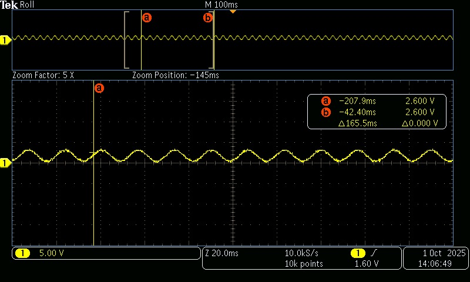

# 📘 Tarea 7 — PWM
---
# 🎵 Tarea 7.1 - Control de Duty Cycle — Motor DC
---

## 1) Resumen
- **Nombre del subproyecto:** Control PWM de motor DC con 3 velocidades  
- **Autor:** Carlos Ernesto Camacho González  
- **Curso / Asignatura:** Sistemas Embebidos  
- **Fecha:** 16/09/2025  
- **Descripción breve:**  
  - Controlar un **motor DC** mediante **PWM** variando el **duty cycle**.  
  - **Dos botones** seleccionan **tres velocidades predefinidas**: baja, media y alta.  
  - Se documentan **valores de duty**, **circuito** y **código**.  

> **Nota de seguridad:** El microcontrolador **no** entrega corriente suficiente para un motor. Debe usarse un **driver/puente H** (p. ej., DRV8833, TB6612FNG o L298N) con **fuente para el motor** y **GND común** con el micro.

---

## 2) Objetivos
- Comprender cómo el **duty cycle** del PWM regula la **velocidad** del motor DC.  
- Implementar una **interfaz simple** con dos botones para seleccionar **tres velocidades**.  
- Configurar correctamente el **hardware PWM** en RP2350/Pico 2 (frecuencia, `wrap`, `clkdiv`).  

---

## 3) Conceptos clave
- **PWM (Modulación por Ancho de Pulso):** controla la **tensión media** aplicada al motor.  
- **Frecuencia PWM:** se usa **2 kHz**. Para evitar zumbido audible
- **Duty predefinido:**  
  - **Baja ≈ 30%**, **Media ≈ 60%**, **Alta ≈ 90%**.

## 4) Código 

~~~c

#include "pico/stdlib.h"
#include "hardware/pwm.h"

#define MOTOR_PWM_PIN   0   // salida PWM al driver (IN1)
#define BTN_UP          1   // subir velocidad
#define BTN_DOWN        2   // bajar velocidad
#define MOTOR_DIR_PIN   3   // dirección (IN2) fija = 1

//  Configuración PWM 
#define F_PWM_HZ 2000       // 2 kHz 
#define TOP      1023       // 10 bits de resolución (0..1023)
#define DEBOUNCE_MS 150

int main(void) {
    stdio_init_all();

    // PWM en pin MOTOR_PWM_PIN
    gpio_set_function(MOTOR_PWM_PIN, GPIO_FUNC_PWM);

    // Dirección fija a 1 (un solo sentido)
    gpio_init(MOTOR_DIR_PIN);
    gpio_set_dir(MOTOR_DIR_PIN, GPIO_OUT);
    gpio_put(MOTOR_DIR_PIN, 1);

    // Botones con pull-up (activo-bajo)
    gpio_init(BTN_UP);    gpio_set_dir(BTN_UP, GPIO_IN);    gpio_pull_up(BTN_UP);
    gpio_init(BTN_DOWN);  gpio_set_dir(BTN_DOWN, GPIO_IN);  gpio_pull_up(BTN_DOWN);

    // Configurar hardware PWM
    uint slice = pwm_gpio_to_slice_num(MOTOR_PWM_PIN);
    uint chan  = pwm_gpio_to_channel(MOTOR_PWM_PIN);

    const float f_clk = 125000000.0f; // 125 MHz
    const float clkdiv = f_clk / (F_PWM_HZ * (TOP + 1));
    pwm_set_clkdiv(slice, clkdiv);
    pwm_set_wrap(slice, TOP);

    const uint16_t duty_levels[3] = {
        (uint16_t)(0.30f * TOP),  // Baja  
        (uint16_t)(0.60f * TOP),  // Media 
        (uint16_t)(0.90f * TOP)   // Alta  
    };
    int speed_level = 0;

    // Iniciar PWM con velocidad "Baja"
    pwm_set_chan_level(slice, chan, duty_levels[speed_level]);
    pwm_set_enabled(slice, true);

    while (true) {
        // BTN_UP: siguiente velocidad
        if (!gpio_get(BTN_UP)) {
            if (speed_level < 2) speed_level++;
            pwm_set_chan_level(slice, chan, duty_levels[speed_level]);
            sleep_ms(DEBOUNCE_MS);
            // Espera a soltar para evitar autorepetición rápida
            while (!gpio_get(BTN_UP)) tight_loop_contents();
        }

        // BTN_DOWN: velocidad previa
        if (!gpio_get(BTN_DOWN)) {
            if (speed_level > 0) speed_level--;
            pwm_set_chan_level(slice, chan, duty_levels[speed_level]);
            sleep_ms(DEBOUNCE_MS);
            while (!gpio_get(BTN_DOWN)) tight_loop_contents();
        }
    }
}
~~~
## 5) Video de demostracion

## video

<iframe
  width="560"
  height="315"
  src="https://www.youtube.com/embed/8ufet_8OE6A"
  title="Control motor DC - demo"
  frameborder="0"
  allow="accelerometer; autoplay; clipboard-write; encrypted-media; gyroscope; picture-in-picture; web-share"
  allowfullscreen
  style="border:0;">
</iframe>

---

## 6) Esquemático de conexión

  
*Figura 1.*

---

## 7) Resultados y conclusiones

- Con 30/60/90% se observan claramente tres regímenes de velocidad.

- Antirrebote bloqueante (150 ms).

- Usar driver dedicado y GND común garantiza estabilidad y protege al microcontrolador.

# 🎵 Tarea 7.2 — Control de Frecuencia: Canción con Buzzer
---

## 1) Resumen
- **Entregable:** Programar un **buzzer piezoeléctrico** para reproducir una **melodía reconocible** (intro de **Pac-Man**).  
- **Técnica:** Variar la **frecuencia del PWM** para cada nota; **duty = 50%**.  
- **Documentar:** Tabla con **notas/frecuencias/duración** y **evidencia** (audio/video).  
- **Recomendación:** Los buzzer piezo suenan mejor ~**532 Hz–4 kHz**. Se usan notas en una octava que cae en ese rango.

---

## 2) Código 

~~~c
#include "pico/stdlib.h"
#include "hardware/pwm.h"

#define BUZZER_PIN 0

#define TOP 1023        // Resolución (10 bits)
#define TEMPO 190       // Tempo rápido

// Duraciones de nota
#define NEGRA        (60000 / TEMPO)
#define CORCHEA      (NEGRA / 2)
#define SEMICORCHEA  (NEGRA / 4)

int main() {
    stdio_init_all();
    gpio_set_function(BUZZER_PIN, GPIO_FUNC_PWM);

    uint slice = pwm_gpio_to_slice_num(BUZZER_PIN);
    uint chan  = pwm_gpio_to_channel(BUZZER_PIN);

    pwm_set_wrap(slice, TOP);
    pwm_set_chan_level(slice, chan, 0);   // empezar en silencio
    pwm_set_enabled(slice, true);

    // Pac-Man (intro + intermisión)
    const float frecuencias[] = {
        // Intro
        987.77, 1479.98, 1244.51, 987.77, 1479.98, 1244.51, 0,
        1046.50, 1567.98, 1318.51, 1046.50, 1567.98, 1318.51, 0,
        987.77, 880.00, 783.99, 698.46, 622.25, 587.33, 0,
        // Intermisión
        783.99, 0, 880.00, 0, 987.77, 0, 783.99,
        987.77, 0, 1046.50, 0, 1174.66, 0, 987.77,
        1174.66, 0, 1244.51, 0, 1318.51, 0, 1174.66
    };

    const int duraciones[] = {
        // Intro
        CORCHEA, CORCHEA, CORCHEA, CORCHEA, CORCHEA, CORCHEA, CORCHEA,
        CORCHEA, CORCHEA, CORCHEA, CORCHEA, CORCHEA, CORCHEA, CORCHEA,
        SEMICORCHEA, SEMICORCHEA, SEMICORCHEA, SEMICORCHEA, SEMICORCHEA, NEGRA, NEGRA,
        // Intermisión
        CORCHEA, SEMICORCHEA, CORCHEA, SEMICORCHEA, CORCHEA, SEMICORCHEA, NEGRA,
        CORCHEA, SEMICORCHEA, CORCHEA, SEMICORCHEA, CORCHEA, SEMICORCHEA, NEGRA,
        CORCHEA, SEMICORCHEA, CORCHEA, SEMICORCHEA, CORCHEA, SEMICORCHEA, NEGRA
    };

    const int num_notas = (int)(sizeof(frecuencias) / sizeof(frecuencias[0]));

    while (true) {
        for (int i = 0; i < num_notas; i++) {
            if (frecuencias[i] > 0.0f) {
                // Para RP2350 el sysclk típico es 150 MHz; si usas RP2040 usa 125 MHz
                const float f_clk = 150000000.0f;
                const float div = f_clk / (frecuencias[i] * (TOP + 1));
                pwm_set_clkdiv(slice, div);
                pwm_set_chan_level(slice, chan, TOP / 2); // 50% duty
            } else {
                // silencio (pausa)
                pwm_set_chan_level(slice, chan, 0);
            }
            sleep_ms(duraciones[i]);
        }
        // Pausa entre repeticiones
        pwm_set_chan_level(slice, chan, 0);
        sleep_ms(2000);
    }
}
~~~

---

## 3) Tabla de notas usadas (referencia)

| Nota (aprox) | Frec. (Hz) | Comentario |
|---|---:|---|
| B5 | 987.77 | Inicio característico |
| F♯6 | 1479.98 | Agudo brillante |
| D♯6 / E♭6 | 1244.51 |  |
| C6 | 1046.50 |  |
| G6 | 1567.98 |  |
| E6 | 1318.51 |  |
| A5 | 880.00 |  |
| G5 | 783.99 |  |
| F5 | 698.46 |  |
| D♯5 / E♭5 | 622.25 |  |
| D5 | 587.33 |  |
| D6 | 1174.66 |  |

> **Tip:** si escuchas distorsión, sube la **frecuencia PWM** manteniendo el **duty 50%**.

---

## 4) Evidencias

### Video / Audio
<iframe
  width="560"
  height="315"
  src="https://www.youtube.com/embed/my9hqDEfWbQ"
  title="Control motor DC - demo"
  frameborder="0"
  allow="accelerometer; autoplay; clipboard-write; encrypted-media; gyroscope; picture-in-picture; web-share"
  allowfullscreen
  style="border:0;">
</iframe>

## 5) Esquemático de conexión

  
*Figura 2.*

---

## 6) Conclusiones (Tarea 7.2)
- La melodía se logra **variando la frecuencia** del PWM con **duty fijo** (50%).  
- Mantener el rango **~532 Hz–4 kHz** asegura buena respuesta del buzzer piezo.  
- Ajustar **clkdiv** en tiempo real permite notas **afinadas** sin bloquear otros procesos.

---

# 🛠️ Tarea 7.3 — Generación de Señales: Senoidal de 60 Hz con PWM + Filtro RC
---

## 1) Resumen
- **Nombre del proyecto:** Señal senoidal con PWM y filtrado RC  
- **Autor:** Carlos Ernesto Camacho González  
- **Curso / Asignatura:** Sistemas Embebidos  
- **Fecha:** 16/09/2025  
- **Descripción breve:**  
  - Generar una **señal sinusoidal de 60 Hz** aproximada mediante **PWM** variando el duty cycle con una tabla seno.  
  - Filtrar la señal usando un **filtro RC pasabajos** para obtener una forma senoidal limpia en el osciloscopio.  
  - Documentar capturas de **PWM sin filtrar** y **señal filtrada**.

---

## 2) Objetivos
- Implementar una **tabla seno** para modular el duty cycle del PWM.  
- Usar un **filtro RC** que atenúe las componentes de alta frecuencia y deje pasar los 60 Hz.  
- Verificar la señal en osciloscopio **antes** y **después** del filtro.

---

## 3) Conceptos clave

### Señal senoidal con PWM
El microcontrolador genera una onda PWM cuyo duty cycle sigue la forma de una tabla seno. Tras el filtrado RC, se obtiene una onda analógica.

## 4) Código 

~~~c
#include <stdio.h>
#include <math.h>
#include "pico/stdlib.h"
#include "hardware/pwm.h"

#define SENAL 0          // Pin GPIO de salida
#define TOP 1023         // Resolución del PWM (10 bits)
#define FREQ 60          // Frecuencia de la señal senoidal deseada (Hz)
#define TAMANO_SENO 100  // Número de puntos en la tabla seno

// Tabla seno (se llenará en tiempo de ejecución)
uint16_t TABLA_SENO[TAMANO_SENO];

int main() {
    stdio_init_all();

    // Llenar tabla seno con valores escalados a [0, TOP]
    for (uint8_t i = 0; i < TAMANO_SENO; i++) {
        double RAD = (2 * M_PI * i) / TAMANO_SENO;
        double VAL = (sin(RAD) + 1.0) / 2.0;  // normalizada a 0–1
        TABLA_SENO[i] = (uint16_t)(VAL * TOP);
    }

    // Configurar pin PWM
    gpio_set_function(SENAL, GPIO_FUNC_PWM);
    uint slice = pwm_gpio_to_slice_num(SENAL);
    uint chan = pwm_gpio_to_channel(SENAL);

    pwm_set_wrap(slice, TOP);
    pwm_set_chan_level(slice, chan, 0);
    pwm_set_enabled(slice, true);

    // Calcular frecuencia de actualización de la LUT
    double RATE = FREQ * TAMANO_SENO;      // actualizaciones/segundo
    uint32_t delay_us = 1000000.0 / RATE;  // periodo en µs

    int INDEX = 0;
    while (true) {
        pwm_set_chan_level(slice, chan, TABLA_SENO[INDEX]);

        INDEX++;
        if (INDEX >= TAMANO_SENO) INDEX = 0;

        sleep_us(delay_us);  // Ajusta la frecuencia
    }
}
~~~

---
## 5) Esquemático de conexión

  
*Figura 3.*

---
## 6) Evidencias

### Osciloscopio
- **Antes del filtro (PWM):** señal rectangular con duty variable.  
- **Después del filtro RC:** onda senoidal de **60 Hz** más limpia.  

  
*Figura 4. Señal PWM *  

  
*Figura 5. Señal senoidal tras el filtro RC.*  

---
## 7) Resultados y conclusiones
- El PWM con duty modulado por tabla seno reproduce correctamente la forma senoidal.  
- El **filtro RC** atenúa los armónicos de alta frecuencia y deja pasar los **60 Hz**.  
- Ajustar **R y C** permite modificar la **frecuencia de corte** para un mejor compromiso entre limpieza de señal y amplitud.  
- Se logró una **señal analógica senoidal** a partir de un pin digital del microcontrolador.

