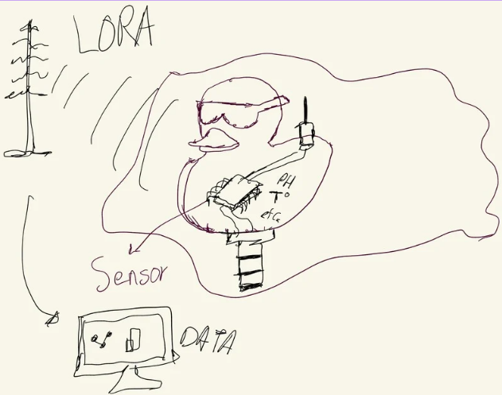

# Citizen Quack — Sistema de monitoreo de calidad del agua (nodo flotante con LoRa)

> Proyecto final — Lanzamiento de producto / Proyecto de Ingeniería  
> **Estado:** ✅ Entrega final documentada (reporte + presentación)

---

## 1) Título del proyecto

**Citizen Quack — Sistema de monitoreo de calidad del agua**  
Nodo flotante con forma de pato, equipado con sensores y comunicación LoRa hacia una estación base.

---

## 2) Equipo / Autores

- **Carlos Ernesto Camacho González**  
- **Danna Paola García Sánchez**  
- **Sebastián Rodas Apango**

---

## 3) Línea de tiempo y contexto

- **Inicio del proyecto:** 01/09/2025 (semana 1)  
- **Estado actual:** Entrega final disponible (reporte PDF + presentación).  
- **Curso / contexto:** Proyecto de Ingeniería / Lanzamiento de producto.

---

## 4) Resumen ejecutivo

**Citizen Quack** es un sistema de monitoreo de calidad del agua basado en un **nodo flotante con forma de pato** que:

- Mide parámetros como:
  - pH  
  - Temperatura  
  - Conductividad eléctrica  
  - (Opcional) otros parámetros según sensores disponibles.
- Envía los datos mediante **LoRa** a una estación base.
- Permite visualizar la información en un **panel / dashboard** para análisis.

**Objetivo principal:**  
Pasar de muestreos manuales e intermitentes a un **monitoreo remoto, más frecuente y escalable** en cuerpos de agua (lagos, presas, canales, etc.), para facilitar la detección temprana de contaminación y apoyar la toma de decisiones.

---

## 5) Problema y motivación

### Problema actual

El monitoreo típico de la calidad del agua suele ser:

- **Manual:** personal debe acudir físicamente al cuerpo de agua.
- **Intermitente:** se realizan pocas mediciones al mes o al año.
- Dependiente de **horarios y disponibilidad** de recursos humanos.

Esto genera:

- Poca información en tiempo real.
- Dificultad para detectar:
  - Cambios bruscos en parámetros críticos.
  - Eventos de contaminación (descargas, derrames, etc.).
- Respuestas tardías ante problemas ambientales.

### Propuesta de Citizen Quack

Citizen Quack plantea:

- Un nodo flotante **económico, replicable y escalable**.
- Posibilidad de desplegar **varios nodos** en un mismo cuerpo de agua.
- Envío periódico de datos hacia una base central mediante LoRa.
- Construcción de **series de tiempo** para análisis y alertas tempranas.

---

## 6) Boceto y recursos visuales

### Boceto del dispositivo (diseño inicial)

> Archivo: `docs/img/citizen-quack-boceto.png`.

### Versión final del pato (impresión 3D)

> Foto del pato impreso con la electrónica montada.

### Dashboard / aplicación

> Captura del dashboard de pH en tiempo real (lecturas recibidas vía MQTT).

---

## 7) Presentación del proyecto

- **Presentación interactiva (Canva):**  
  [Ver presentación en Canva](https://www.canva.com/design/DAG5dyTq7m4/BNC3U07SQSMNoSyPcmzIfw/view?embed)

### Presentación (PDF exportado de Canva — embebido)

<embed 
  src="../presentacion-proyectos-danna.pdf" 
  type="application/pdf" 
  width="100%" 
  height="700px" />

> Si no se muestra correctamente, puedes descargarla aquí:  
> [📊 Descargar presentación en PDF](../presentacion-proyectos-danna.pdf)

---

## 8) Reporte final del proyecto

### Reporte final (PDF embebido)

<embed 
  src="../entrega-final-proyecto-lanzamiento.pdf" 
  type="application/pdf" 
  width="100%" 
  height="700px" />

> Si el visor no se carga correctamente, también puedes descargar el archivo aquí:  
> [📄 Descargar reporte final](../entrega-final-proyecto-lanzamiento.pdf)
